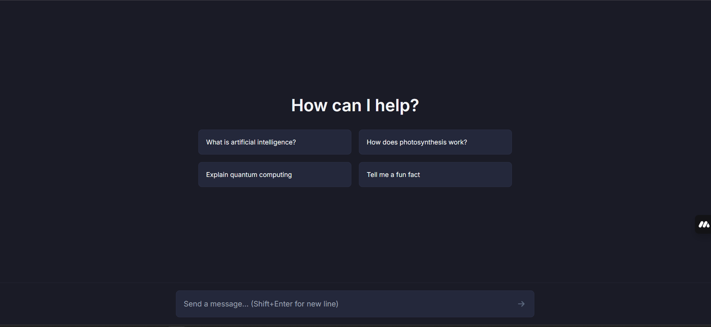

# Royal Chat Simulator

An elegant chat interface for AI interactions with a modern, minimalist design.

## Features

- Clean, dark-themed user interface
- Suggested questions for easy interaction
- Smooth message input with Shift+Enter support
- Modern, responsive design

## Tech Stack

- Next.js 14 with App Router
- TypeScript
- Tailwind CSS
- Vercel AI SDK
